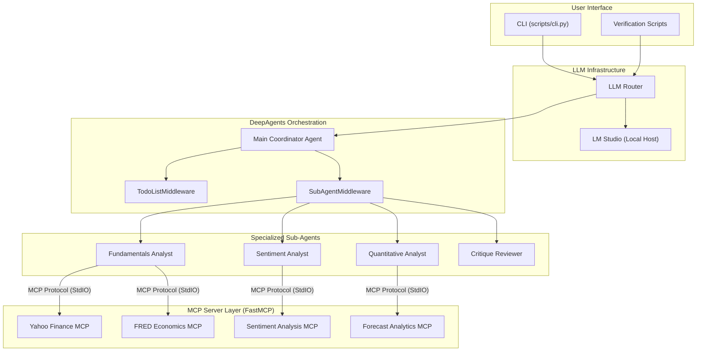
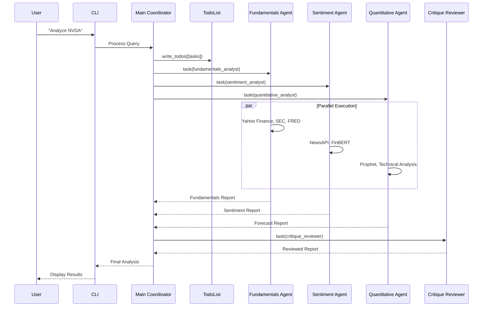

# 🧠 Quant-DeepAgent

A sophisticated **Multi-Agent AI Trading Research System** built with [LangChain DeepAgents](https://github.com/langchain-ai/deepagents). This system orchestrates specialized AI agents to analyze stocks, perform sentiment analysis, forecast prices, and generate comprehensive investment reports.

## 🏗️ System Architecture



## 🔄 Agent Workflow



## ✨ Features

### 🤖 Multi-Agent System
- **Main Coordinator**: Orchestrates sub-agents and synthesizes reports
- **Fundamentals Analyst**: Financial health, valuation, SEC filings analysis
- **Sentiment Analyst**: News sentiment via FinBERT, market mood
- **Quantitative Analyst**: Price forecasting with Prophet, technical indicators
- **Critique Reviewer**: Quality assurance and report refinement

### 📊 Financial Data Tools
| Tool | Source | Purpose |
|------|--------|---------|
| Yahoo Finance | `yfinance` | Stock prices, financials, recommendations |
| SEC EDGAR | `sec-edgar-downloader` | 10-K/10-Q filings with text extraction |
| FRED | Federal Reserve | Macroeconomic indicators (GDP, rates) |
| NewsAPI | newsapi.org | Market news articles |

### 🔮 Analysis & Forecasting
- **Prophet**: Time-series price forecasting
- **Technical Indicators**: RSI, MACD, Bollinger Bands, SMA/EMA
- **FinBERT**: Financial sentiment analysis

### 📚 RAG Pipeline
- **Embeddings**: Sentence-transformers (`all-MiniLM-L6-v2`)
- **Vector Store**: ChromaDB for document storage
- **Chunking**: Recursive + SEC-specific strategies
- **Retrieval**: Hybrid dense + sparse retrieval

### 🔌 LLM Providers
| Provider | Model | Status |
|----------|-------|--------|
| LM Studio (Local) | Any (via OpenAI Compat.) | ✅ Active |
| MLX (Local) | Llama-3.1-8B-Instruct-4bit | ⚠️ Secondary |
| Groq | llama-3.3-70b-versatile | ✅ Supported |

## 🚀 Quick Start

### Prerequisites
- Python 3.11+
- Apple Silicon Mac (for MLX) or cloud API keys

### Installation

```bash
# Clone the repository
git clone https://github.com/kaushikkumarkr/Quant-Deepagent.git
cd Quant-Deepagent

# Create virtual environment
python -m venv .venv
source .venv/bin/activate

# Install dependencies
pip install -e .
```

### Configuration

Create a `.env` file with your API keys:

```bash
# Required for news data
NEWS_API_KEY=your_newsapi_key

# Required for macro data
FRED_API_KEY=your_fred_key

# LLM Providers (at least one required)
GROQ_API_KEY=your_groq_key        # Fast cloud inference
GEMINI_API_KEY=your_gemini_key    # Good tool calling
# MLX works without API keys (local)
```

### Usage

```bash
# Interactive CLI
python scripts/cli.py

# Example query
> Analyze NVDA
```

## 📁 Project Structure

```
quantmind/
├── src/
│   ├── agents/              # DeepAgents multi-agent system
│   │   ├── graph.py         # Main agent graph
│   │   ├── tools.py         # LangChain tool wrappers
│   │   ├── prompts/         # Agent system prompts
│   │   └── subagents/       # Specialized agent nodes
│   ├── llm/
│   │   ├── router.py        # LLM provider routing
│   │   └── providers/       # Groq, Gemini, MLX wrappers
│   ├── tools/
│   │   ├── financial/       # Yahoo, SEC, FRED
│   │   ├── sentiment/       # FinBERT, NewsAPI
│   │   ├── forecast/        # Prophet, Technical
│   │   └── search/          # Web search
│   ├── rag/                  # RAG pipeline
│   └── utils/                # Logging, cache, retry
├── scripts/
│   └── cli.py               # Interactive CLI
├── tests/                    # Unit & integration tests
└── pyproject.toml
```

## 🎯 DeepAgents Middleware

This project uses [LangChain DeepAgents](https://github.com/langchain-ai/deepagents) with the following middleware:

| Middleware | Purpose | Tools Provided |
|------------|---------|----------------|
| `TodoListMiddleware` | Task planning & tracking | `write_todos`, `read_todos` |
| `FilesystemMiddleware` | File operations | `ls`, `read_file`, `write_file` |
| `SubAgentMiddleware` | Task delegation | `task` |

## 🔧 Configuration Options

### LLM Router Priority

The router selects LLMs based on availability and suitability:

```python
# src/llm/router.py
Priority: MLX (local) > Groq > Gemini
```

### Local LLM (LM Studio)
Ensure LM Studio is running on `http://localhost:1234/v1`. The router mimics OpenAI compatibility.
```python
# src/config.py
lmstudio_url = "http://localhost:1234/v1"
```

## 📈 Example Output

```
🚀 QuantMind CLI - Interactive Research Agent
--------------------------------------------------
Enter ticker or query: Analyze NVDA

🕵️ Researching: Analyze NVDA...

🔹 Step: model
🛠️  Call: write_todos ([5 tasks planned])
🛠️  Call: task (fundamentals_analyst)
🛠️  Call: task (sentiment_analyst)
🛠️  Call: task (quantitative_analyst)

🔹 Step: tools
📝 Fundamentals: P/E 65.2, Revenue $60.9B (+126% YoY)...
📝 Sentiment: Bullish (0.82 confidence)...
📝 Forecast: 30-day target $158.50 (+12%)...

🔹 Final Report
...
```

## 🧪 Testing

```bash
# Run all tests
pytest tests/

# Run specific test suite
pytest tests/unit/test_tools.py -v
```

## 📝 License

MIT License - See [LICENSE](LICENSE) for details.

## 🙏 Acknowledgments

- [LangChain DeepAgents](https://github.com/langchain-ai/deepagents) for the agent framework
- [MLX](https://github.com/ml-explore/mlx) for Apple Silicon inference
- [yfinance](https://github.com/ranaroussi/yfinance) for financial data
- [Prophet](https://facebook.github.io/prophet/) for forecasting
