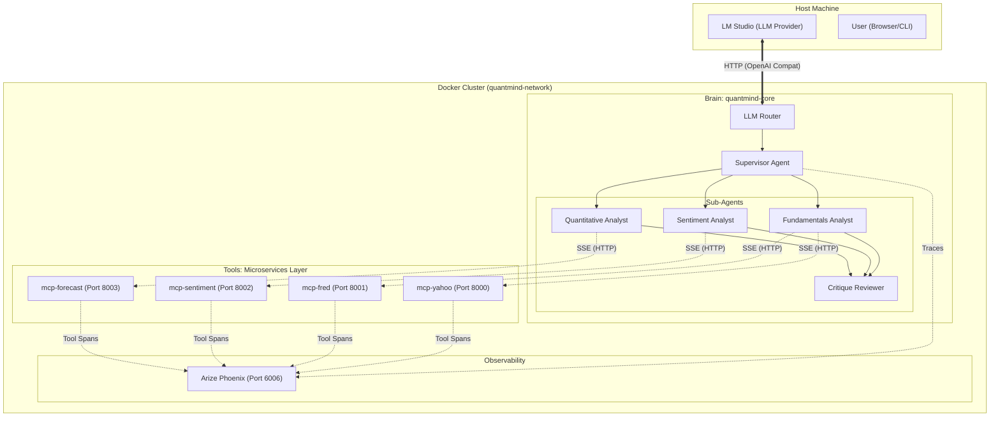

# 🧠 QuantMind: DeepAgents Financial Research System

**QuantMind** is an advanced **Multi-Agent AI Research Platform** that autonomously performs institutional-grade financial analysis.

Built on **LangChain DeepAgents** and a **Dockerized Microservices Architecture**, it orchestrates a team of specialized AI agents to analyze fundamentals, news sentiment, and technical forecasts in parallel, synthesizing their findings into comprehensive reports.

---

## 🏗️ System Architecture

The system operates as a **Distributed Cognitive Engine**. The "Brain" (DeepAgents) runs in one container, while the "Hands" (Tools) run as separate, secure microservices.



---

## 🤖 The Agent Team

| Agent | Persona | Responsibilities | Tools (Microservices) |
|-------|---------|------------------|-----------------------|
| **Supervisor** | *Hedge Fund Manager* | Planning, delegation, synthesis. | `None` (Orchestration) |
| **Fundamentals** | *Equity Research Analyst* | Valuation (P/E, DCF), Financials (10-K), Macro. | `mcp-yahoo`, `mcp-fred` |
| **Sentiment** | *News Analyst* | Market mood, headlines, social sentiment. | `mcp-sentiment` |
| **Quantitative** | *Data Scientist* | Price forecasting (Prophet), Technicals (RSI/MACD). | `mcp-forecast` |
| **Critique** | *Risk Manager* | Quality control, fact-checking, hallucination detection. | `None` (Pure LLM) |

---

## 🚀 Quick Start (Docker)

The entire system is containerized. You do not need to install Python or dependencies locally.

### 1. Prerequisites
*   **Docker Desktop** (Running)
*   **LM Studio** (For Local LLM) or a **Groq API Key**.

### 2. Configure LM Studio (Critical)
1.  **Load Model:** `Meta-Llama-3.1-8B-Instruct` (Recommended).
2.  **Start Server:** Port `1234`.
3.  **⚠️ Context Length:** Set to **`8192`** (Default 4096 is too small for DeepAgents memory).

### 3. Environment Setup
Create a `.env` file in the root directory:

```bash
# Required for News/Sentiment
NEWS_API_KEY=your_key_here

# Required for Economic Data
FRED_API_KEY=your_key_here

# Optional (if using Cloud LLM)
GROQ_API_KEY=your_key_here
```

### 4. Run the System
```bash
# Build and start all microservices
docker compose up -d --build

# Enter the Brain container
docker exec -it quantmind-core python scripts/cli.py
```

### 5. Verify Installation
Run the end-to-end verification script inside the container:
```bash
docker exec quantmind-core python scripts/verify_lmstudio.py
```

---

## 🔬 Observability

Traces and internal thought processes are captured by **Arize Phoenix**.

*   **Dashboard:** [http://localhost:6006](http://localhost:6006)
*   **Features:**
    *   View the full "Mind Map" of agent reasoning.
    *   Inspect raw JSON payloads sent to MCP tools.
    *   Debug latency and errors.

---

## 📁 Project Structure

```text
quantmind/
├── docker-compose.yml       # Service Definitions (Brain + 4 MCPs + Phoenix)
├── src/
│   ├── agents/              # DeepAgents Logic
│   │   ├── graph.py         # Main Graph & Sub-Agent Config
│   │   └── tools_registry.py # Maps Tools -> Docker Environment Vars
│   ├── tools/               # Robust Tool Implementations
│   │   ├── financial/       # Yahoo & FRED Logic
│   │   ├── sentiment/       # NewsAPI Logic
│   │   └── forecast/        # Prophet Logic
│   └── llm/                 # Router & Providers
├── scripts/
│   ├── cli.py               # Interactive Chat Interface
│   ├── verify_all_tools.py  # Microservice Health Check
│   └── verify_lmstudio.py   # End-to-End Agent Test
└── README.md
```

---

## 🛠️ Technology Stack

*   **Framework:** [LangChain DeepAgents](https://github.com/langchain-ai/deepagents)
*   **Protocol:** [Model Context Protocol (MCP)](https://modelcontextprotocol.io) via `fastmcp`
*   **Transport:** Server-Sent Events (SSE) over HTTP
*   **Infrastructure:** Docker Compose
*   **LLM:** Llama 3.1 (Local) / Groq Llama 3.3 (Cloud)

---

## 📝 License
MIT License
